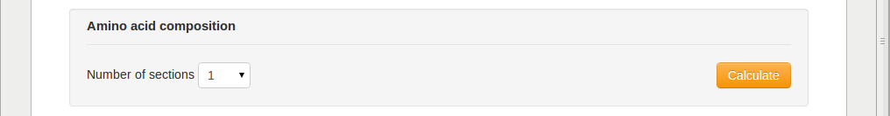
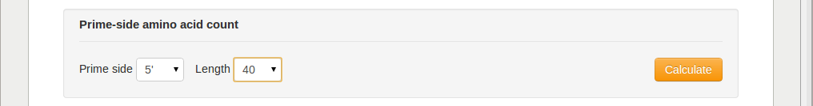
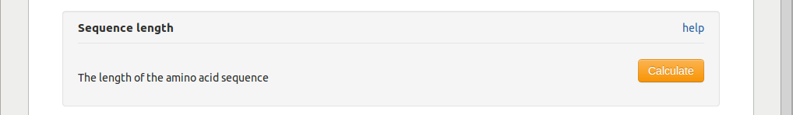
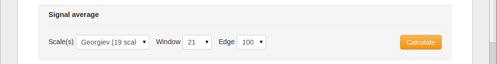
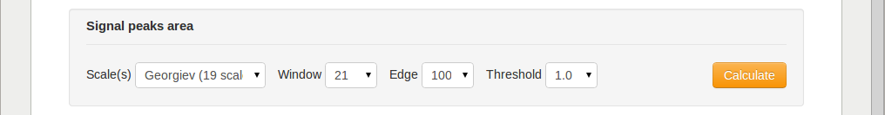
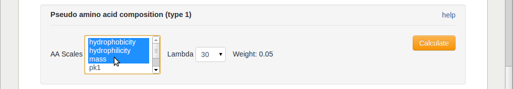
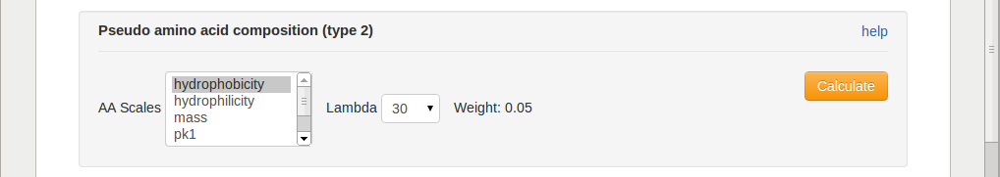

.. _features_spice:

==============
SPiCE features
==============

After project initiation, you can use the *Calculate* button under the
*Features* tab to calculate a range of sequence-based protein features.

.. image:: img/featcalc0.png
   :width: 640px
   :align: center

The following sections describe the different feature categories that can be
calculated on the SPiCE website. Some of these features were used in our
previous research :cite:`vandenberg2010` :cite:`vandenberg2012`, and the rest
was extracted from other feature calculation methods :cite:`li2006`
:cite:`rao2011`, :cite:`shen2008`, :cite:`cao2013`.

----------------------
Amino acid composition
----------------------

The amino acids composition calculates the relative frequency of occurrence for
each of the 20 amino acids in a protein sequence.

Having 20 amino acids, this will result in 20 features. Any other than the 20
unambiguous amino acid letters will be ignored.

To illustrate this, consider the following (unrealistic) protein sequence,
which contains two occurrences of each amino acid in which each amino acid
obtains the value 0.05::

    >>aac_test
    MMAARRNNDDCCEEQQGGHHIILLKKFFPPSSTTWWYYVV

will result in the following feature vector::

    .              A1          R1       ...        V1
    
    aac_test      0.05        0.05      ...       0.05

As a parameter, users can specify in how many (equal sized) segments a protein
should be divided, before calculating the amino acid composition of each
segment separately. The number of features will therefore be the number of
segments times 20.

With 2 as number of segments parameter, the sequence will be split in two::

    segment 1              segment2
    MMAARRNNDDCCEEQQGGHH | IILLKKFFPPSSTTWWYYVV

The amino acid composition of both segments is calculated which together
results in a feature vector with 40 features::

    .              A1   ...   V1   ...   A2   ...   V2

    aac_test      0.10  ...  0.00  ...  0.00  ...  0.10

---------------------
Dipeptide composition
---------------------

Similar to the amino acid composition, the dipeptide composition calculates the
relative frequency of occurrence of each of the 400 possible dipeptides in a
protein sequence.

.. image:: img/feat_dipep.png
   :width: 640px
   :align: center

Having 400 possible amino acid pairs (dipeptides), this will result in 400
features. Dipeptides containing any other than the 20 unambiguous amino acid
letters will be ignored.

As a parameter, users can specify in how many (equal sized) segments a protein
should be divided, before calculating the dipeptide composition of each
segment separately. To limit the number of features and to avoid too sparse
feature matrices, the maximal number of segments is set to 2.

For an example sequence that contains 10 dipeptides::

    >>dc_test
    MAAARRNNDDC

The resulting feature vector will be::

    .           AA      AR   ...   AV      RA      RR         VV
    
    dc_test    0.20    0.10  ...  0.00    0.00    0.10  ...  0.00

-----------------------------
Terminal end amino acid count
-----------------------------

This feature category returns the amino acid counts of a fixed length sequence,
either at the N- or the C-terminal end of the protein sequence.

For example sequence::

    >>teraac_test
    MMAARRNNDDCCEEQQGGHHIILLKKFFPPSSTTWWYYVV

the amino acid counts of the length 10 C-terminal end result in the following
feature vector::

    .            A   R   N   D   C   E   Q   G   H  ...  M  ...  V

    teraac_test  2   2   2   2   0   0   0   0   0  ...  2  ...  0

in which the counts for M, A, R, N, and D are set to 2, while the remaining 15
features are set to 0.

---------------
Sequence length
---------------

This category calculates only one feature, the length of the amino acid
sequence.

The example sequence::

    >>>len_test
    MMAARRNNDD

Will result in the following feature vector::

    .           len

    len_test     10

------------------------------------------------------
Property Composition / Transition / Distribution (CTD)
------------------------------------------------------

The Composition, Transition, Distribution feature is introduced in
:cite:`dubchak1995`, the implementation is based on the description in
:cite:`li2006`. 

For these features, the protein sequence is first translated
from the 20 letter amino acid alphabet to a 3 letter alphabet, in which the 20
amino acids are divided over the three letters based on some property. The
properties and corresponding subdivision of the amino acids are::

    property                letter A            letter B            letter C
    ---------------------------------------------------------------------------
    hydrophobicity          RKEDQN              GASTPHY             CLVIMFW

    normalized v.d. Waal    GACSTPD             NVEQIL              MHKFRYW

    polarity                LIFWCMVY            PATGS               HQRKNED

    polarizability          GASDT               CPNVEQIL            KMHFRYW

    charge                  KR                  ANCQGHILMFPSTWYV    DE

    secondary structure     EALMQKRH            VIYCWFT             GNPSD

    solvent accessibility   ALFCGIVW            PKQEND              MRSTHY

To illustrate this, using charge as property, an amino acid sequence will be
mapped to a three letter charge alphabet as follows::

    MPMDQSISSPLFPMEKDIDIPLDATPLAQSSSLQLFIHLAEPVVFLQGFDPQKTEYPSVVLRGCLVVRIL
       |          |:| |   |                 |        |  : |      :     :  
    BBBCBBBBBBBBBBCACBCBBBCBBBBBBBBBBBBBBBBBCBBBBBBBBCBBABCBBBBBBABBBBBABB

For the mapped sequence, three types of features are calculated. First the
property letter composition::

    composition A:  4 / 70 = 0.057

    composition B: 58 / 70 = 0.114

    composition C:  8 / 70 = 0.829

Secondly the relative frequency of occurrence of letter transitions. For
letters A and B this is the number of transitions from A to B and from B to A
divided by the sequence length - 1::

    transition A-B B-A:  6 / 69 = 0.087

    transition A-C C-A:  2 / 69 = 0.029

    transition B-C C-B: 14 / 69 = 0.203

Finally the property letter distribution is captured by 5 features per
property letter. If we consider letter C, the first feature is the (procentual)
sequence position of the first occurrence of the C::

    distribution C first:  4 / 70 = 0.057

The following 4 features are the (procentual) sequence positions where
respectively 25%, 50%, 75%, and 100% of the letters C is on and before this
position::

    distribution C  25%: 15/70 = 0.214

    distribution C  50%: 19/70 = 0.271

    distribution C  75%: 41/70 = 0.586

    distribution C 100%: 55/70 = 0.786

The same five features are calculated for letters A and B as well. In total the
CTD feature category provides 3 + 3 + 5 x 3 = 21 features for a given property.

---------------
Autocorrelation
---------------

The autocorrelation captures correlations between residue properties at a given
distance over the whole sequence.

Based on the user-defined amino acid scale (see :ref:`feature_data_sources`),
a protein sequence is first translated to a property profile. Than, for a given
distance between two residues (the *lag* parameter), the method traverses over
the protein sequence, calculating a correlation measure for all residue pairs
at distance *lag*. Three different autocorrelation calculation types are
offered (the *type* parameter), all using a different correlation measure:
normalized Moreau-Broto :cite:`moreau1980`, Moran :cite:`moran1950`, and Geary
:cite:`geary1954`.

The implementation is based on the description is :cite:`li2006`, more
information about the implementation details can be found there.

--------------
Signal average
--------------

This feature translates a protein sequence into a property profile using
a user-defined amino acid scale (see :ref:`feature_data_sources`), and
calculates the average profile (signal) value as feature.

The *window* and *edge* parameter determine how much the profile is smoothed
before calculating the feature. A larger window results in more a more smoothed
profile. The edge determine how much influence the residues at the edge of the
window have on the smoothing (see also Fig.1B in :ref:`feature_data_sources`).

Amino acid scales relate to different amino acid properties, such as
hydropathicity. The average value of such a scale therefore provides an
indication of the global hydropathicity of the protein.

-----------------
Signal peaks area
-----------------

The same as the previous feature, but instead of taking the average profile
value, this feature calculates the area under the profile curve under and above
some given threshold (see also Fig.1C in :ref:`feature_data_sources`).

..    include:: <isogrk1.txt>

------------------------------------
Pseudo amino acid composition type 1
------------------------------------

The type 1 pseudo amino acid composition, also called the parallel-type,
calculates 20 + |lgr| features as introduced in :cite:`chou2001` and provides
the same calculation as provided on the PseAAC webserver :cite:`shen2008`. The
same amino acid scales as on the PseAAC webserver are also provided, of which
one or more can be selected. Details about these features and how they are
calculated are given on the PseAAC-type1_ help site.

.. _PseAAC-type1: http://www.csbio.sjtu.edu.cn/bioinf/PseAAC/type1.htm

------------------------------------
Pseudo amino acid composition type 2
------------------------------------

The type 2 pseudo amino acid composition calculates 20 + *i* x |lgr| features,
in which *i* is the number of selected amino acid scales, as introduced in
:cite:`chou2005` and provides the same calculation as provided on the PseAAC
webserver :cite:`shen2008`. The same amino acid scales as on the PseAAC
webserver are also provided, of which one or more can be selected. Details
about these features and how they are calculated are given on the PseAAC-type2_
help site.

.. _PseAAC-type2: http://www.csbio.sjtu.edu.cn/bioinf/PseAAC/type2.htm

--------------------------------
Quasi sequence-order descriptors
--------------------------------

The quasi-sequence-order descriptors are introduced in :cite:`chou2000`.

-------------------------------
Secondary structure composition
-------------------------------

Secondary structure sequences may contain three letters, the same that are used
by secondary structure prediction method PSIPRED: C (random coil), H (helix),
E (strand). This feature calculates the composition of these three letters.

.. image:: img/feat_ssc.png
   :width: 640px
   :align: center

----------------------------------------------
Per secondary structure amino acid composition
----------------------------------------------

This feature category calculates the amino acid composition per secondary
structure element.

.. image:: img/feat_ssaac.png
   :width: 640px
   :align: center

For example, for the following amino acid and corresponding secondary structure
sequence::

    protein:     A A A A A A F F F F F F D D D D D D
                 | | . . . . . . * * * * . . | | | | 
    sec. struct: C C H H H H H H E E E E H H C C C C

The sequences will be split per secondary structure type, gathering all
residues that are annotated with the same secondary structure letter::

    C (random coil): A A D D D D

    H (helix):       A A A A F F D D

    E (strand):      F F F F

The composition of these three subsequence is than calculated and returned as
features::

    .    |        coil        |       helix        |       strand       |
            CA     CD     CF     HA     HD     HF     EA     ED     EF
    
           0.33   0.66   0.00   0.50   0.25   0.25   0.00   0.00   1.00

This example only shows the composition of three amino acids (A,F,D), resulting
in 3 x 3 = 9 features. When using all amino acids, 3 x 20 = 60 features are
returned.  

---------------------------------
Solvent accessibility composition
---------------------------------

Solvent accessibility sequences may contain two letters: B (buried),
E (exposed). This feature calculates the composition of these two letters.

.. image:: img/feat_sac.png
   :width: 640px
   :align: center

------------------------------------------------------
Per solvent accessibility class amino acid composition
------------------------------------------------------

This feature category calculates the amino acid composition per solvent
accessibility class (buried/exposed).

For example, for the following amino acid and corresponding solvent
accessibility sequence::

    protein:     A A A A A A F F F F F F D D D D D D
                 . . . . | | | | . . | | | | . . . .
    solvaccess:  E E E E B B B B E E B B B B E E E E

The sequences will be split in a list with buried and a list with exposed amino
acids::

    E: A A A A F F D D D D

    B: A A F F F F D D

The composition of these two subsequence is than calculated and returned as
features::

    .    |      exposed       |       buried       |       
            EA     ED     EF     BA     BD     BF   
    
           0.40   0.40   0.20   0.25   0.25   0.50

This example only shows the composition of three amino acids (A,F,D), resulting
in 2 x 3 = 6 features. When using all amino acids, 2 x 20 = 40 features are
returned.  

-----------------
Codon composition
-----------------

This feature category calculates the relative frequency of occurrence of each
of the 64 codons in a protein's ORF sequence.

.. image:: img/feat_cc.png
   :width: 640px
   :align: center

-----------
Codon usage
-----------

This feature category calculates the relative usage for each codon per amino
acid in the protein sequence.

.. image:: img/feat_cu.png
   :width: 640px
   :align: center

To illustrate this, consider the following protein amino acid sequence,
consisting of only alanines, and the
corresponding ORF sequence::

    amino acid:    A   A   A   A   A   A   A   A   A   A
           ORF:   GCC GCC GCC GCC GCC GCA GCA GCA GCT GCT

Since four different codons encode for alanine: GCT, GCC, GCA, and GCG, the
example ORF sequence can only consist of these 4 codons. The codon usage
feature calculates the relative frequency of occurrence of these four codons,
resulting in the following 4 feature values::

    .       GCT    GCC    GCA    GCG
            0.2    0.5    0.3    0.0

All other codon values will be set to 0.0 in this example. In a real sequence,
containing all 20 amino acids, this procedure is done for each amino acid,
resulting in a total of 64 features, one per codon. 

.. TODO: special cases methionine and stop codons.

----------
References
----------

.. bibliography:: refs.bib
