===========================
Tutorial 1: Getting started
===========================

This tutorial shows you the basic functionalities of the web site using one of
the example projects. The tutorial is split into three sections, each
describing one of the main tabs: *Projects*, *Features*, and *Classification*.

--------
Projects
--------

You can manage your projects under the *Projects* tab. Here you can create,
activate, and delete projects. It also allows you to inspect project details
and upload additional sequence data or labeling files for your projects.

^^^^^^^^^^^^^^^^^^^^^^^
Create example projects
^^^^^^^^^^^^^^^^^^^^^^^

To get started, let's first create a project. To load an example project, go to
the *Project* tab and click on the **Create** button.

.. image:: img/t1_0_create_0.png
   :width: 550px
   :align: center

A list of example projects can be found at the bottom of the page. Select
*yeast-expression* project and click on the **Load project** button to initiate
the example project.

.. image:: img/t1_0_create_1.png
   :width: 550px
   :align: center

You will be redirected to your list op projects, which should contain the
*yeast-expression* project.

.. image:: img/t1_0_create_1_1.png
   :width: 550px
   :align: center

Load a second example project by clicking the **Create** button again. Select
the *A. niger high-level secretion* and load the project. Again, you will be
redirected to your list of projects, which should now contain two projects.

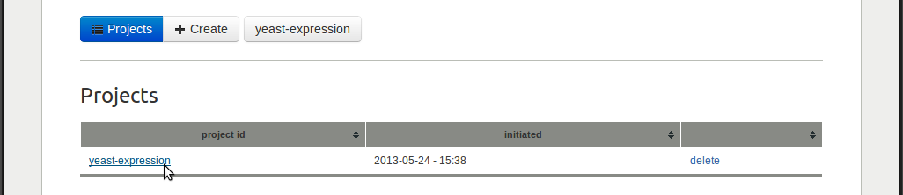

The list of projects provides a link to the project's details page in the first
column, the project initiation time in the second column, and a *delete* link
in the third column. The *delete* link will delete all files related to the
project, so be careful with that.

^^^^^^^^^^^^^^^^^^^
Activating projects
^^^^^^^^^^^^^^^^^^^

Notice that the *user bar*, situated underneath the main tabs, indicates which
project is currently active.

.. image:: img/t1_0_create_3.png
   :width: 550px
   :align: center

If you have multiple projects, an additional *select project* link will appear,
which allows you to activate another project.

.. image:: img/t1_0_create_4.png
   :width: 550px
   :align: center

It is important to note that the *features* and *classification* tabs will show
the data of the active project. Remember that the *user bar* always shows you
which project is active and allows you to activate another project.

Use the *user bar* to select the *yeast-expression* project, which will
redirect you to the details page of that project.

^^^^^^^^^^^^^^^
Project details
^^^^^^^^^^^^^^^

Activating a new project will always redirect you to that project's details
page. On this page, the active button (the blue one) shows the name of the
project. 

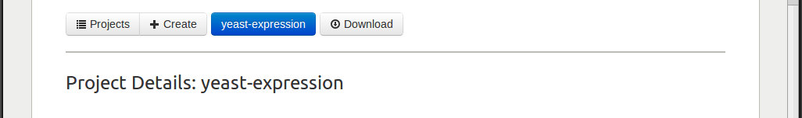

If you have multiple projects, this button turns into a drop-down button where
you can select one of the projects (the same as in the *user bar*).

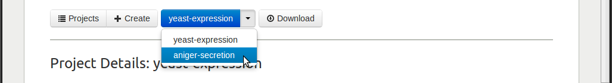

If you click the **Download** button on the right, all data of the currently
active project will be zipped into a zip-file and downloaded to your computer.
The zip-file contains all project data: the sequence data, calculated features
data, and trained classifiers data.

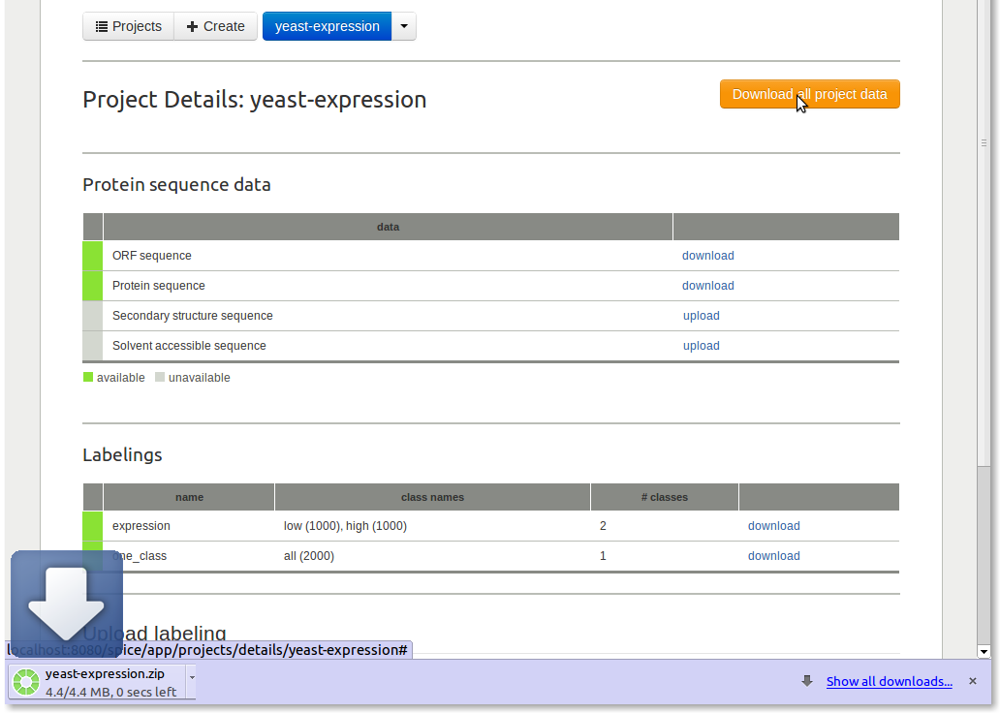

^^^^^^^^^^^^^^^^^^^^
Protein sequece data
^^^^^^^^^^^^^^^^^^^^

The *Protein sequence data* shows the available sequence data for this project.

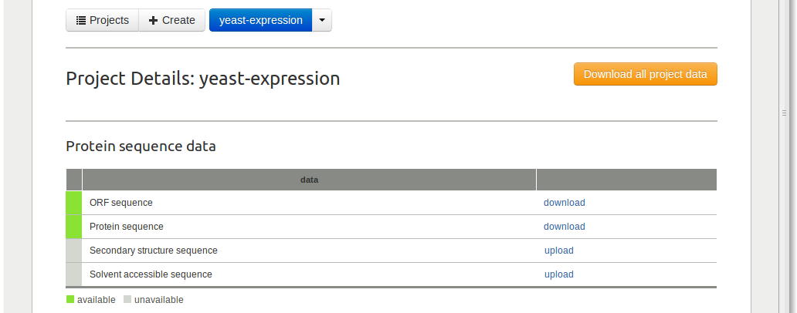

In case of the *yeast-expression* project, both ORF (nucleotide) and protein
(amino acid) sequences are available. With the *download* link you can download
the corresponding FASTA files to your computer. If you have FASTA files with
(predicted) secondary structure or solvent accessibility sequences, you can use
the *upload* links to upload them.

^^^^^^^^^^^^^^^^^
Protein labelings
^^^^^^^^^^^^^^^^^

The *Labeling* table shows the available labelings for this project. 

.. image:: img/t1_0_create_9.png
   :width: 550px
   :align: center

A labeling is a mapping from each protein to a label, thereby separating the
set of proteins into different classes. The *expression* labeling of the
*yeast-expression* splits the 2000 proteins into two classes: 1000 proteins
with the label *low*, and 1000 proteins with the label *high*.  All projects
obtain a default labeling upon project creation. This is the *one_class*
labeling, in which all proteins obtain the same label (*all*). 

For every labeling, the table shows: the name of the labeling in the first
column; the different classes and the number of proteins per class in the
second column, the number of classes in the third column, and a *download* link
in the third column.

The form at the bottom of the page can be used to upload additional labeling
files. 

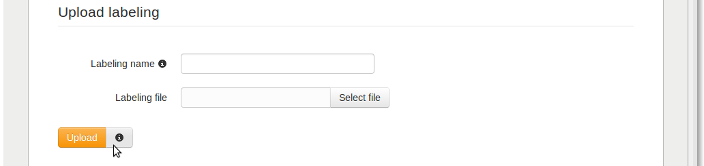

Consult the :ref:`file_formats` documention for more information on the
labeling file format. To see an example, you can download the labeling file of
the *yeast-expression* project.

--------
Features
--------

Click on the *Features* tab to go the features area, which provides
feature calculation and visualization. 

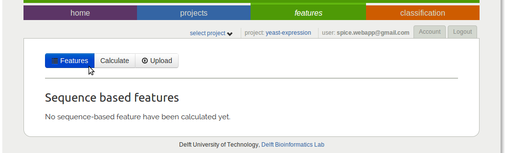

Since you have not calculated any features yet, this page will show an empty
list.

^^^^^^^^^^^^^^^^^^^
Feature calculation
^^^^^^^^^^^^^^^^^^^

Click on the **Calculate** button to go to the feature calculation page.

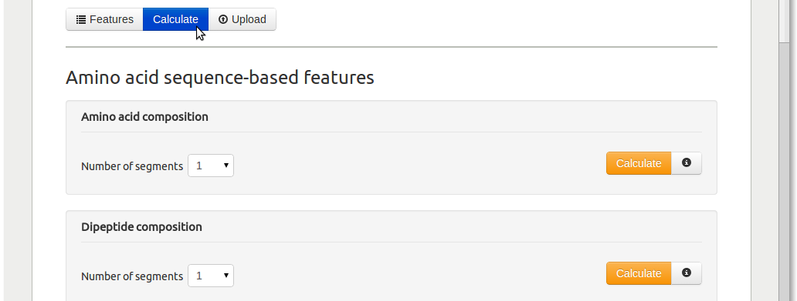

Here, a list with sequence-based feature categories is shown. For each feature
category one or more dropdown boxes enables setting some parameters and the
**Calculate** button will put the feature calculation job in the job queue on
the compute servers. Although feature calculation usually does not take long,
if the compute server is busy, your job might have to wait in queue for a
while.

More information on the available sequence-based features is described in the
:ref:`features` documentation.

Once you have calculated some features, a table with calculated feature
categories will occur under the **Features** button, in which the first column
describes the name of the feature category, the second column lists the used
parameters, the third column shows how many features are in this category, and
the last column provides a link to delete the feature category.

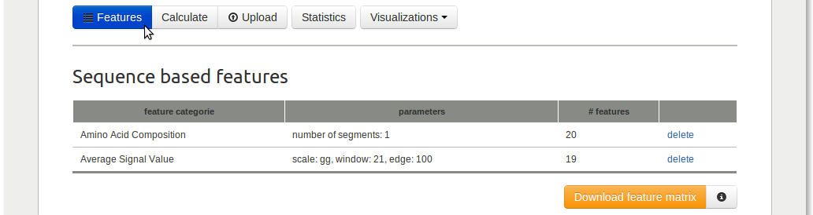

Now with the *yeast-expression* project still active, calculate the amino acid
composition with the number of segments parameter set to 1, and signal average
with parameter settings - scales(s): Georgiev, window: 21, and edge: 100. 

If the feature calculation is finished, click on the **Statistics** button to
start exploring them.

^^^^^^^^^^^^^^
Filter sidebar
^^^^^^^^^^^^^^

Before explaining about the feature statistics and visualization possibilities,
the *filter sidebar* will be discussed first. The filter sidebar is used
throughout the website enabling users to select features (feature matrix
columns) and protein classes (feature matrix rows of the proteins that share
the same class label). By default the side bar is hidden on the right side,
click on the dark gray tab with the arrow to open the side bar.

.. image:: img/tut1_10.png
   :width: 550px
   :align: center

The *Label filter* at the top can be used to select protein classes.

.. image:: img/tut1_11.png
   :width: 550px
   :align: center

The drop-down box can be used to select one of the available labelings. The
*yeast-expression* project has the default *one-class* labeling, in which each
protein obtains the same label, and an *expression* labeling, in which the
proteins are separated into a *low* and *high* expression class, each
containing 1000 proteins.

Use the drop-down box to select the *expression* labeling.

.. image:: img/tut1_12.png
   :width: 550px
   :align: center

All the labels of the currently selected labeling are shown underneath the
drop-down box, which should now show the *low* and *high* label. The labels on
the left (in yellow) are selected and the labels on the right (in gray) are not
selected. You can click on the arrow of a label button to select or deselect
it, i.e. to move it from left to right or the other way around.

In order to show *t*-statistics, exactly two labels (protein classes) need to
be selected. Select both the *low* and the *high* label. The *t*-statistics
table remains empty, because we first need to select for what features we want
to see the *t*-value, which can be done with the *Feature filter*.

The *Feature filter* shows all feature categories that have been calculated.
The *show/hide* link can be used to show or hide the features that are part of
the corresponding feature category. By default, all feature are hidden. 

Click on the *show/hide* link of the *Amino Acid Composition* category to show
its features.

.. image:: img/tut1_13.png
   :width: 550px
   :align: center

You can click on the features to select them. To select multiple features, hold
down the **Ctrl** button while clicking the features, or hold down the left
mouse button while drawing a rectangle over the features you want to select.

.. image:: img/tut1_14.png
   :width: 550px
   :align: center

The *Select all* and *Deselect all* links at the top can be used to select all
and deselect all features of the corresponding feature category.

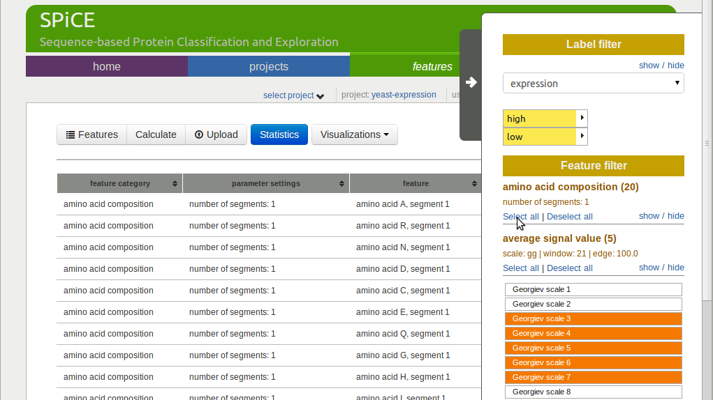

The number between brackets behind the feature category name indicates how many
of the features of that category are selected.

^^^^^^^^^^^^^^^^^^
Feature statistics
^^^^^^^^^^^^^^^^^^

Select all features to show their *t*-values in the table.

.. image:: img/tut1_16.png
   :width: 550px
   :align: center

One row appears for each feature, giving the feature category name, feature
name, *t*-value, and corresponding *p*-value in the four columns.

Click the *t*-value header to sort the table by that column. The codon fraction
*GGT (G)* has the highest *t*-value, indicating class separation for this
feature. 

Use the feature filter to select only this feature, the table should now
contain only a single row, showing the *GGT (G)* feature.

^^^^^^^^^^
Histograms
^^^^^^^^^^

Histograms can be used to visualize feature value distributions for the
different protein classes. Use the **Visualizations** drop-down button to select
*histogram*.

The website should have remembered what labels and features were selected (this
requires that cookies are enabled), in which case the histogram of the *GGT
(G)* feature shown for the labels *low* and *high*. 

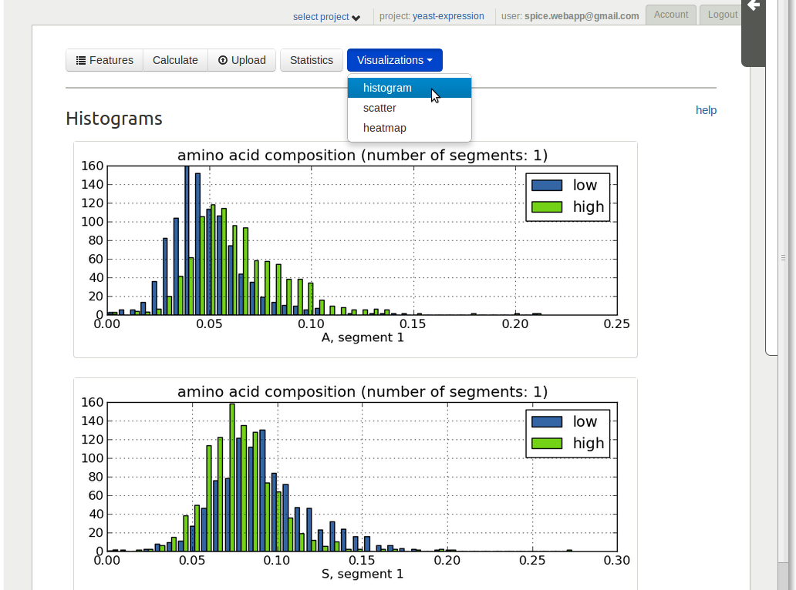

The distributions clearly show a difference between the *low* and *high* class.

Use the *Feature filter* in the side bar to select the codon composition *CGA
(R)* feature as second feature (hold down the **Ctrl** button while clicking
this feature so that the first feature remains selected as well). The histogram
for this feature should appear underneath the first histogram.

Notice that you can drag and drop the histograms to enable reordering the
histograms on screen. Click on the top histogram and hold down the mouse
button, drag the histogram down and drop it underneath the other histogram. 

^^^^^^^^^^^^^
Scatter plots
^^^^^^^^^^^^^

With the *GGT (G)* and *CGA (R)* still selected, choose the *scatter* option
from the **Visualizations** drop-down button.

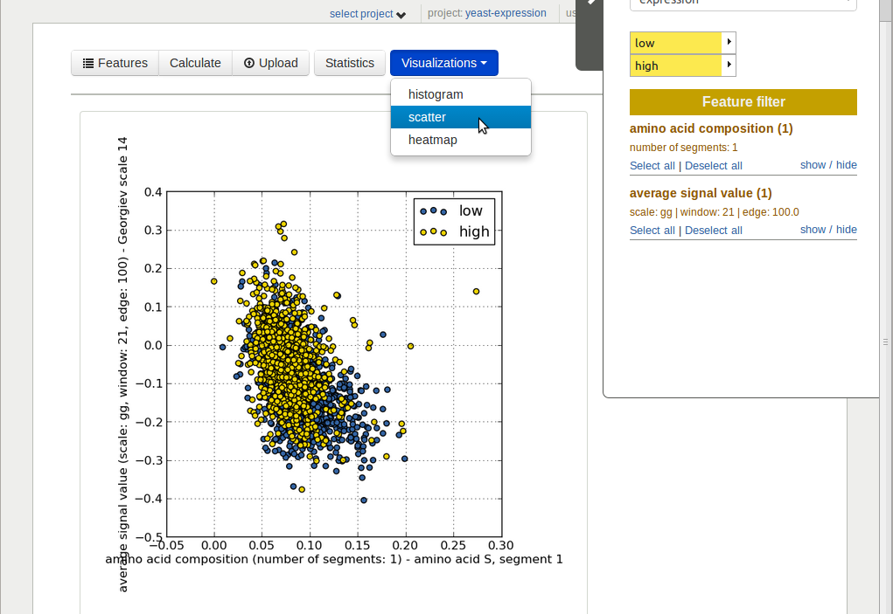

A scatter plot is shown with the GGT(G) feature values on the *y*-axis and the
*CGA (R)* feature values on the *x*-axis. The *high* proteins are shown in blue
and the *low* proteins in yellow. The *low* proteins are now on top of the
*high* proteins. This depends of the order in which the label in the *Label
filter* are selected.

Notice that a scatter plot will only be shown if exactly two features are
selected. 

^^^^^^^^^^^^^^^^^^
Clustered heat map
^^^^^^^^^^^^^^^^^^

Use the *Feature filter* to select deselect all features in the *Codon
composition* category and select all features in the *Amino acid composition*
category. Afterwards select the *heatmap* option from the **Visualizations**
drop-down button.

.. image:: img/tut1_19.png
   :width: 550px
   :align: center

A heat map with hierarchically clustered rows (proteins) and columns (features))
is shown. Depending on the size of the feature matrix, it can take a minute or
two for the heat map to appear. 

The heat map visualizes the standardized (mean 0.0, std 1.0) values of the
feature matrix. The columns are the selected features and the rows are the
proteins in the selected classes (labels). The column on the right shows the
protein labels, white for *high* labeled proteins and gray for *low* labeled
proteins.

--------------
Classification
--------------

The *t*-statistics and visualizations showed that some feature-value
distributions are different between the *high* and *low* class. Now let's try
to train a classifier that uses these features to predict if a proteins belongs
to either the *low* or the *high* class. A cross-validation_ protocol is used
to determine how well this can be predicted using the selected features.

.. _cross-validation: http://en.wikipedia.org/wiki/Cross-validation_(statistics)

^^^^^^^^^^^^^^
New classifier
^^^^^^^^^^^^^^

Click the *Classification* tab and click the **Create** button.

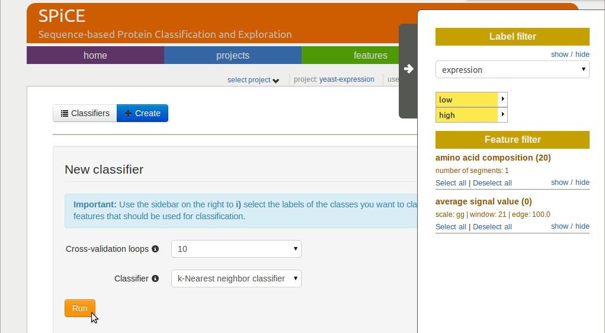

Use the *Feature filter* to select the 20 amino acid composition features,
select 10 cross-validation loops, and the *k*-nearest neighbor classifier with
uniform weights. Click the **Run** button to start the experiment. 

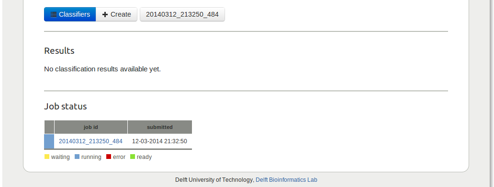

You will be redirected to the *Results* page, where the current status of your
job is shown in the table at the bottom. Depending on how busy the server is,
the job might have to wait in queue for a while.

Add two more classification jobs, both for a LDA classifier and 10
cross-validation loops. Use all *amino acid composition* features for the first
and all *codon composition* features for the second. 

^^^^^^^^^^^^^^^^^^^^^^
Classification results
^^^^^^^^^^^^^^^^^^^^^^

Classification results will be shown in the *Results* table as soon as a job is
finished.

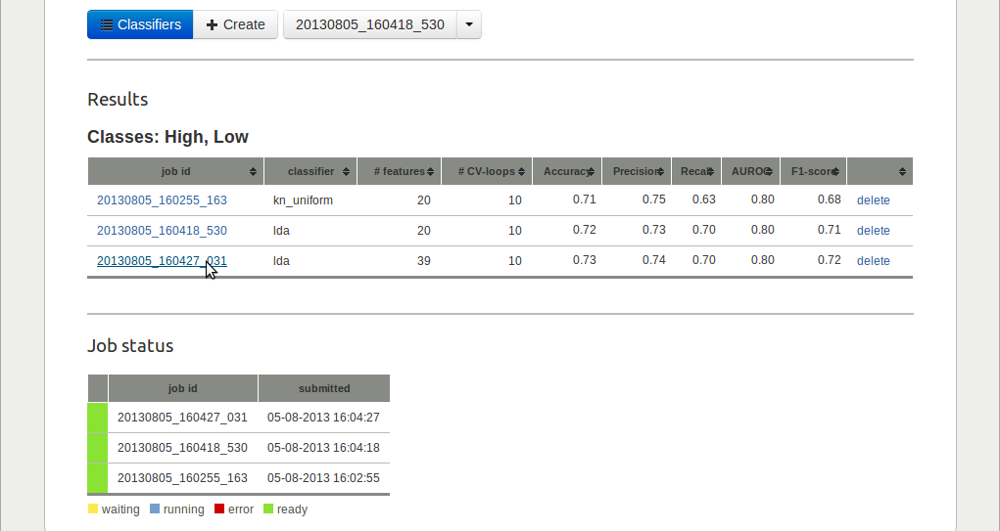

The table shows different performance measures for each classifier. With an
area under the ROC-curve (AUROC) of 0.85, the 64 *codon composition* features
performed best in this example.

^^^^^^^^^^^^^^^^^^
Classifier details
^^^^^^^^^^^^^^^^^^

Click on the job with the 20 *amino acid composition* features to see more
detailed results.  At the top, some classification setting and a table with the
cross-validation results are shown.

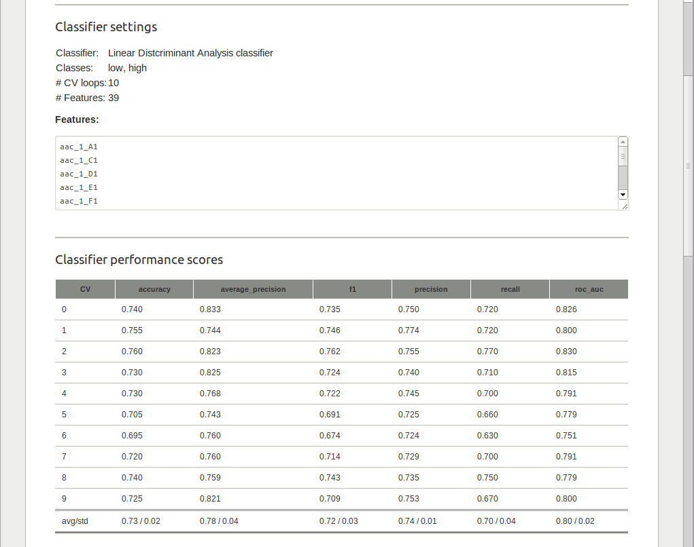

In case of a 2-class classification problem, an ROC-curve is shown underneath.

.. image:: img/tut1_24.png
   :width: 550px
   :align: center

The gray ROC-curves show the cross-validation results and the blue curve shows
the average ROC-curve. The area under the ROC-curve (and the standard deviation
for the different CV-loops) are given in the legend.
The classifier details page also allows you to run a trained classifier on
another data set. To do so, you first need to create a new project with a
FASTA file that contains the sequences for which you would like to have
predicted classes. 

^^^^^^^^^^^^^^^^^^^^
Test your classifier
^^^^^^^^^^^^^^^^^^^^

To test a trained classifier on another data set, go to the details page of one
of the classifiers. Click the **Run** button and use the dropdown box to select
the *aniger-secretion* data set. 

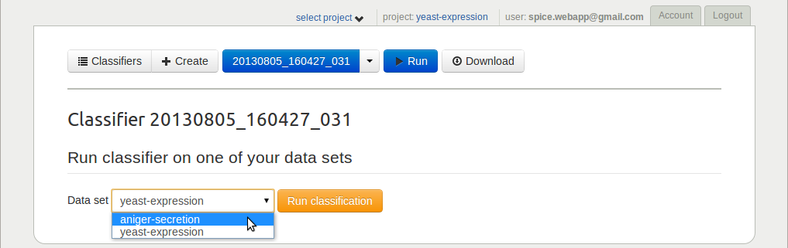

Since the required features are not yet calculated for this project, this will
be done automatically behind the scenes. As soon as the features are
calculated, the classifier will be run on this data set. Both the feature
calculation job and the classification job are put in queue, so it might take
a while for them to be finished depending on how busy the compute server is.

Links to a file with binary predictions and predicted class probabilities (if
available for the classifier) will be offered in a table when classification is
finished.

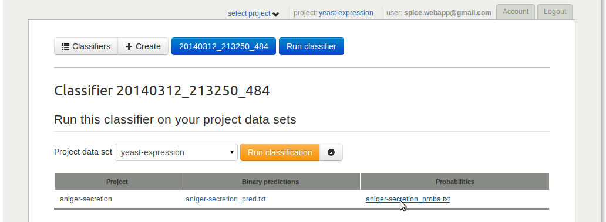

^^^^^^^^^^^^^^^^^^^^
Download raw results
^^^^^^^^^^^^^^^^^^^^

Finally, all classifier details can be downloaded as zip-file using the
**Download** button.

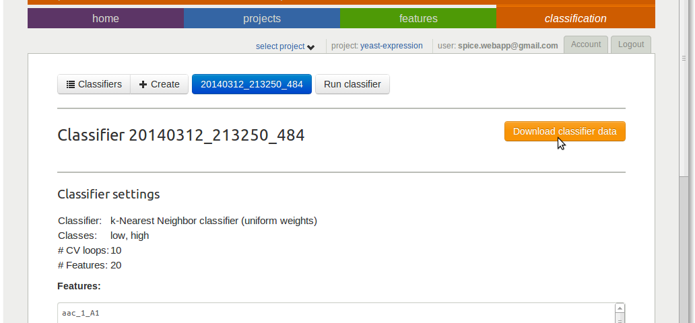

This finalizes the first tutorial, which covered most of the SPiCE website
functionalities. If you have any suggestions for improvements, or if you find
any bugs, please let me know (spice.webapp@gmail.com).
